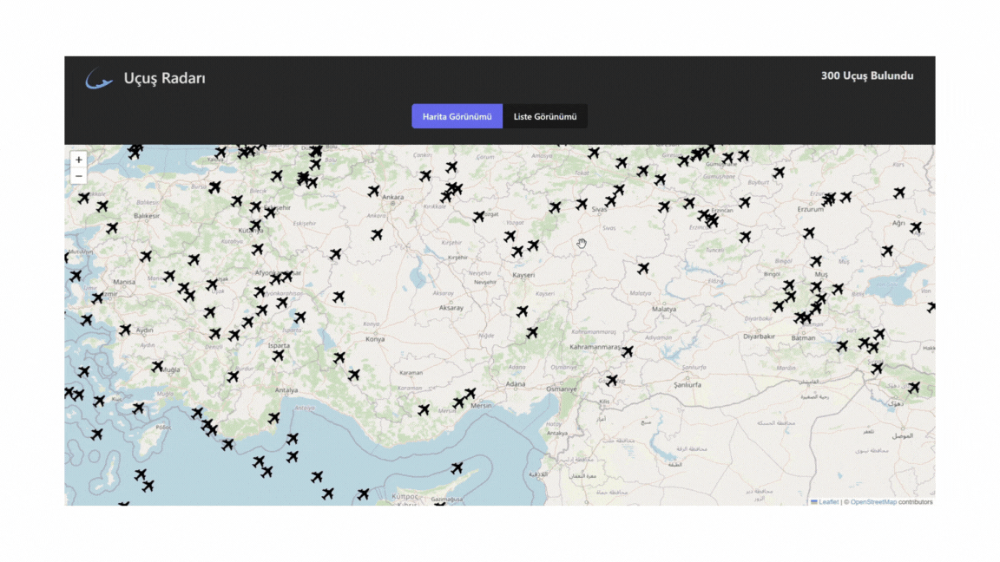

# Kütüphaneler

- @reduxjs/toolkit
- react-redux
- axios
- bootstrap
- leaflet
- react-leaflet

# API

- https://rapidapi.com/apidojo/api/flight-radar1/playground

## Ozellikler

- Header Bileşeni: Uygulama başlığını ve uçuş verilerinin mevcut durumunu (yükleniyor, hata veya mevcut uçuşlar) gösterir.

- Modal Bileşeni: Seçilen uçuş hakkında detaylı bilgi sunar, uçak modeli, kaydı, görselleri, havayolu bilgileri ve uçuş saatleri gibi bilgileri içerir. Hata yönetimi ve yüklenme göstergeleri de bulunur.

- ListView Bileşeni: Uçuş detaylarını görüntüleme ve sayfalar arasında geçiş yapma seçenekleri sunar.

- MapView Bileşeni: Her bir uçuş için işaretleyiciler ve uçuş rotalarını göstermek için bir poligon kullanarak harita üzerinde uçuş verilerini görüntüler. Uçuş detaylarını görüntüleme ve mevcut rotayı temizleme seçenekleri içerir.

- Redux Entegrasyonu: Uçuş verilerini ve durumu Redux ile yönetir. API'den uçuş verilerini çekmek için asenkron işlemler ve yüklenme durumlarını ve hataları ele almak için reducer'lar içerir.

- Pagination: ListView bileşeninde uçuş verilerinin sayfalamasını yönetmek için react-paginate kullanılır.

- Tarih Formatlama: Unix zaman damgalarını Modal bileşeninde görüntülenebilir hale getirmek için moment kütüphanesini kullanır.

- API Entegrasyonu: Uçuş radar API'sinden uçuş verilerini çeker ve uygulamada görüntülenmek üzere işler.

# GIF

